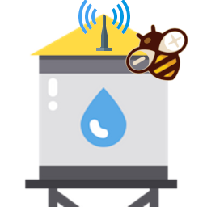

# ReWaL
## LoRa remote water tank level and pump controller - Server

### Changelog
 - 10/05/2022 v1.0 First release

### Problem
First the problem: I must refill a 1,5Km far water tank, so I need two devices:
 - a server that manages a pump: if the remote tank isn�t full the server start the pump with a relay and when the tank is full, stop the pump.
    - Start-stop pump;
    - Manage the remote message;
    - Prevent dangerous action if the remote device is no more active;
    - Monitor to select an operation mode and status.
 - A client that is in a remote position (tank position) checks the water level and warns the Server if It�s all ok or the tank is full.
    - Check the max and min level;
    - Warn Server about status;
    - Battery and solar-powered;
    - Sleep mode if no more need.

### A simple demo
Here is a simple demo video.

### Documentation
1. [LoRa remote water tank level and pump controller: intro](https://www.mischianti.org/2022/05/03/lora-remote-water-tank-level-and-pump-controller-rewal-intro-1/)
2. [LoRa remote water level and pump controller: server software](https://www.mischianti.org/2022/05/10/lora-remote-water-level-and-pump-controller-esp8266-server-software-2/)
3. [LoRa remote water level and pump controller: client software](https://www.mischianti.org/2022/05/20/lora-remote-water-level-and-pump-controller-rewal-client-software-3/)
 4. LoRa remote water level and pump controller: server PCB
 5. LoRa remote water level and pump controller: client PCB
 6. LoRa remote water level and pump controller: entire server with 3D printed case
 7. LoRa remote water level and pump controller: entire client with 3D printed case